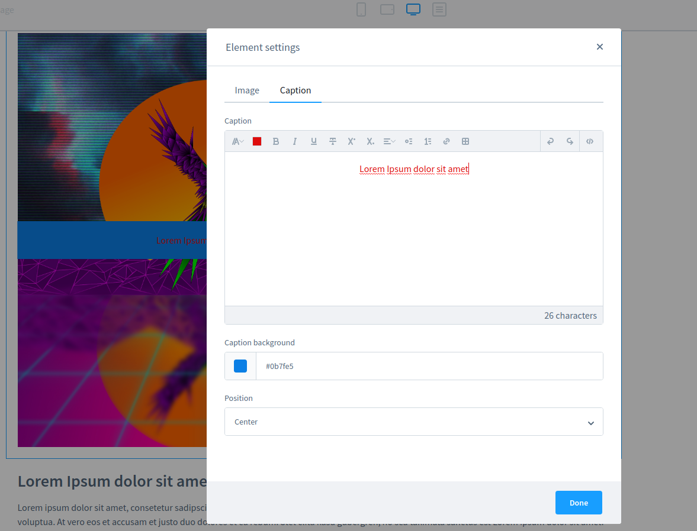

# Zeo S6 Cms Elements Plugin (ZeobvCmsElements)

This plugins adds new Shopping Expeelements to Shopware 6.

## Featured Elements

### Image Caption

This element extends the default image element with additional options to place an caption.

## Get started with the Zeo Cms Elements Plugin:
- Add your plugin as a submodule to the project by executing the following command from the project root
    - ``git submodule add git@bitbucket.org:webdesignzeo/zeo-cms-elements.git custom/plugins/ZeobvCmsElements``
    - ``git add custom/plugins/ZeobvCmsElements && git commit -m "Added ZeobvCmsElements submodule." && git pull && git push``
- Finally, activate the plugin via the console
    - ``./psh.phar docker:ssh``
    - ``composer dump``
    - ``./bin/console plugin:refresh``
    - ``./bin/console plugin:install --clearCache --activate ZeobvCmsElements``

## License

The proprietary License. Please see [License File](LICENSE) for more information.
