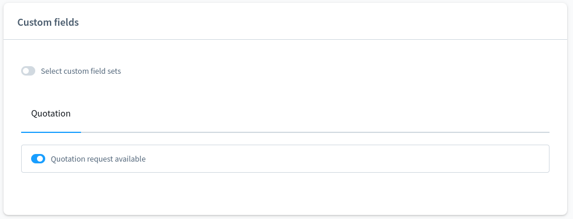
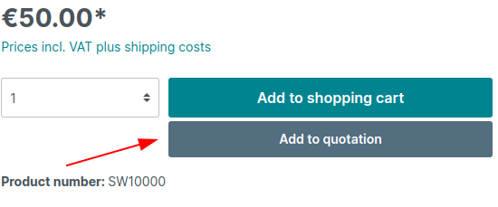
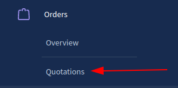
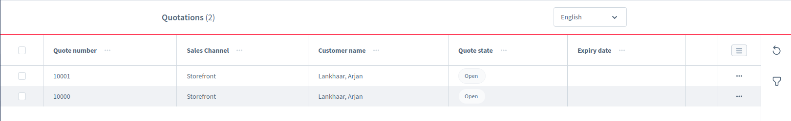
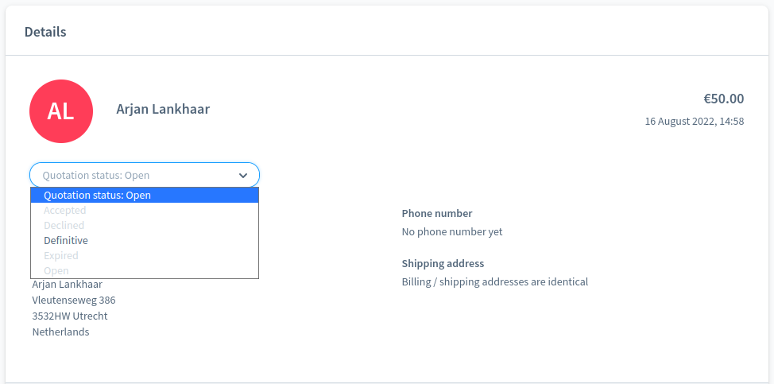
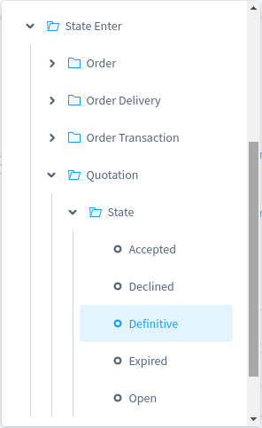

# Zeo S6 Quotation Plugin (ZeobvQuotations)

## License

The proprietary License. Please see [License File](LICENSE) for more information.

## Description

The Quotation plugin adds a full functionality for handling quotations. This includes 
requesting a quotion, finalizing it in the admin and accepting/declining it for customers.
This plugin is also completely compatible with the Shopware API so it can work with all 
sorts of order management systems.

## Get started with the Zeo Quotation Plugin:

- Add your plugin as a submodule to the project by executing the following command from the project root
    - ``git submodule add git@bitbucket.org:webdesignzeo/zeo-s6-quotations.git custom/plugins/ZeobvQuotations``
    - ``git add custom/plugins/ZeobvExamplePlugin && git commit -m "Added ZeobvQuotations plugin as new submodule." && git pull && git push``
- Finally, activate the plugin via the console
    - ``./psh.phar docker:ssh``
    - ``composer dump``
    - ``./bin/console plugin:refresh``
    - ``./bin/console plugin:install --clearCache --activate ZeobvQuotations``

## Using PHPStan static code analysis
- Use psh.phar docker:ssh to enter in the Shopware docker instance
- Change your directory to the dir of the plugin in question e.g. custom/plugins/ZeobvExamplePlugin
- execute sh bin/static-analyze.sh. This will generate a phpstan.neon file from the included phpstan.neon.dist file.

## User documentation
By default, a product cannot be quoted so you first have to configure your products to be able to be quoted.
Next a customer can request a quotation for the configured products and the quotation will be added in the admin overview where you can finalize it.

### Configure a product
To make a product quoteable, you have to configure the custom field for it. You can find the custom fields section
under the "Specifications" tab in the product detail page. There you can find yourself the "Quotation" custom field set and check or uncheck the "Quotation request available" field.

### Request quotation for product(s)
After you have configured a product to be quoteable, you can request a quotation for it. In the buybox on the PDP there will
be a "Request quotation" button. Click on this button and the product will be added to your quote.

After clicking the button, the offcanvas will open, showing your quote underneath your shopping cart. Now click the "Go to quotation" button.
This will take you to the quotation overview page. Here the customer can see all the products that are in his quote and he can comment on every
product individually. After that's been done, you can click the "Request quotation" button. Now you should see a success message showing your quotation
is created successfully.

### View quotations in admin
If you log into the admin, underneath the "Order" menu you will find the link to the "Quotations" menu. Click on it to open the quotation overview page.

In the admin overview you can see all the quotations that are available. You can see the quote number, customer, the sales channel and the 
quotation state for each quotation in this overview.

Click on the quotation number or the 3 dots at the end of a line to open the quotation detail page.

### Manage quotations in admin
Regarding managing the quotations, 2 things are important. First, you have to configure the correct prices. You easily do that by pressing the "Edit"
button at the top right of the quotation detail page. Then scroll down to the items overview. Here you can edit the default prices, add promotions, 
add products or custom items and you could even configure the delivery costs (just click on the shipping costs). To edit a specific property, just double
click it in the table. After you're finished, just hit the save button on the top right.

After you have configured the prices, you can finalize the quotation. If you scroll back to the top of the page, you can configure the quotation status.
If you set this to "Definitive", the quotation will be finalized and you can notify the customer.

### Configure automatic notifications for the customer (optional)
If you want to send the customer an email when the quotation is marked as definitive and Shopware will be responsible for this kind of email communication,
you can configure this in the flow builder. The current quotation management is fully compatible with the Shopware flow builder. 
Before you add a flow, you first have to create an email template.

To add a flow, just go to the flow builder (Settings > Flow Builder) and click the "Add flow" button on the top right. Now name your flow to however you like.
Next, open the "Flow" tab to configure the trigger and the actions (and optionally any conditions). Now, select the 
"State Enter > Quotation > State > Definitive" trigger as shown below.

Now you can add whatever actions you want to the flow. You can add the "Send email" action to email the customer.
